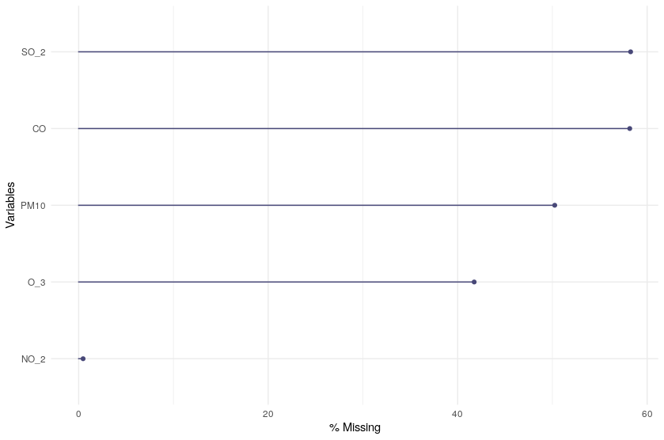
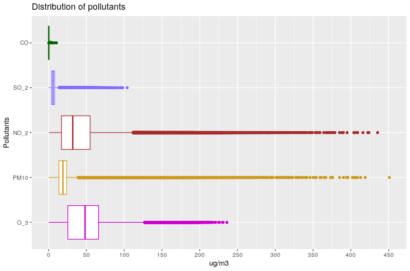
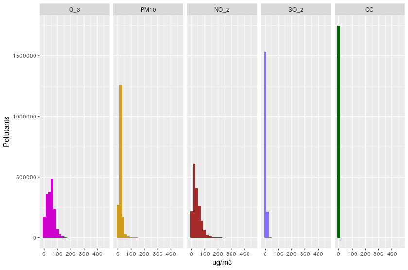
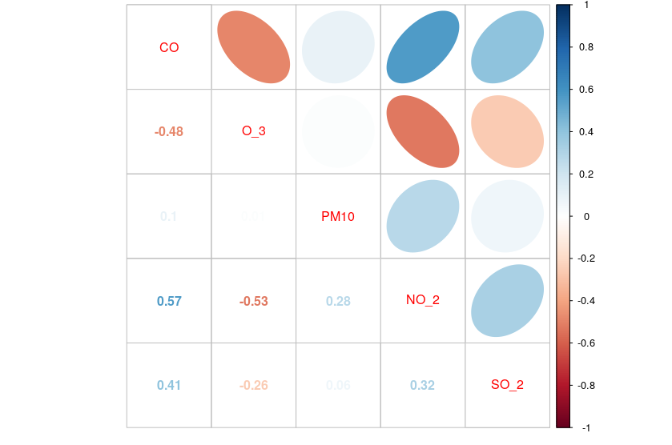
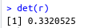
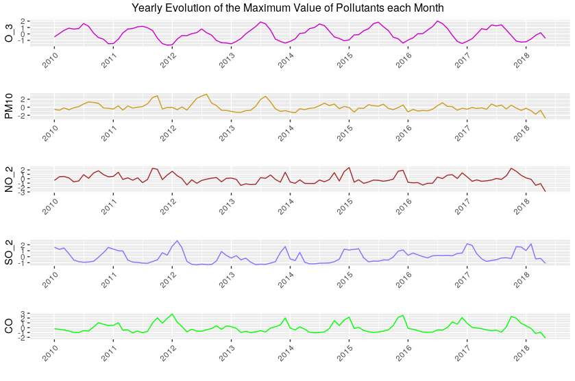
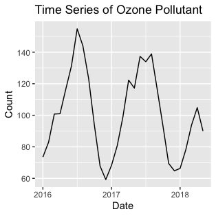
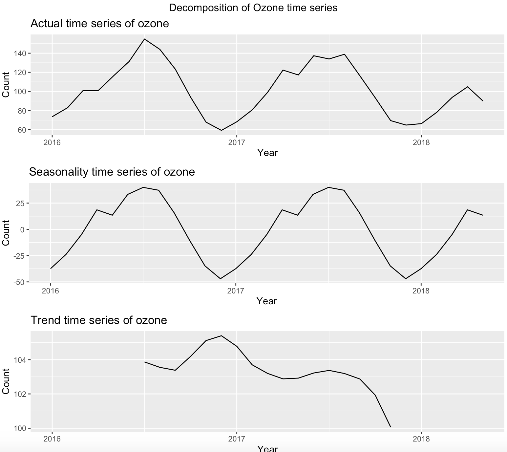

```{r setup, include=FALSE}
knitr::opts_chunk$set(echo = TRUE)
```

## Abstract

## Introduction and related work

## Exploratory data analysis

### Dataset description

Before exposing the findings during the exploratory data analysis, important information and background about the dataset is introduced below:

The dataset used for this work was obtained from [Kaggle's website](https://www.kaggle.com/ "Kaggle's website"). In this page, we can find a lot of information and datasets about the air quality in Madrid.

Our data is composed by **18 data sets** that contain observations of the level of presence of **various gases** in Madrid's air, **which can be noxious for human health**, during the last 18 years (from 2001 to 2018). This information is recorded by 24 different stations, each one located in a different area of the city, that measure the level of presence of each pollutant through several sensors. There is data about the presence of each gas during each hour of the day, every day of every month. 

The data in this data set has been collected from the original files provided by [Madrid Open Data.](https://datos.madrid.es/portal/site/egob/menuitem.c05c1f754a33a9fbe4b2e4b284f1a5a0/?vgnextoid=9e42c176313eb410VgnVCM1000000b205a0aRCRD&vgnextchannel=374512b9ace9f310VgnVCM100000171f5a0aRCRD&vgnextfmt=default) Decide soluciones organization processed them and uploaded to the [Kaggle's website](https://www.kaggle.com/decide-soluciones/air-quality-madrid).

Regarding the **observations**, all csv files include data for every month, except the last one (2018) that only has records until  May. According to this, we have the following number of rows for each data set (note that the stations.csv stores information about the 24 stations through which the information about the pollutants was measured):

| CSV | Observations |
| --- | ------------ |
| Stations.csv | 24 rows |
| Madrid2001.csv | 217872 rows |
| Madrid2002.csv | 217296 rows |
| Madrid2003.csv | 243984 rows |
| Madrid2004.csv | 245496 rows |
| Madrid2005.csv | 237000 rows |
| Madrid2006.csv | 230568 rows |
| Madrid2007.csv | 225120 rows |
| Madrid2008.csv | 226392 rows |
| Madrid2009.csv | 215688 rows |
| Madrid2010.csv | 209448 rows |
| Madrid2011.csv | 209928 rows |
| Madrid2012.csv | 210720 rows |
| Madrid2013.csv | 209880 rows |
| Madrid2014.csv | 210024 rows |
| Madrid2015.csv | 210096 rows |
| Madrid2016.csv | 209496 rows |
| Madrid2017.csv | 210120 rows |
| Madrid2018.csv | 69096 rows |

We can also differentiate two domains whose columns represent different data:

On the one hand, as it was mentioned above, we have the Stations.csv with six columns, which contain information about the stations:

* id: unique identifier for each station.
* address: location of the station in Madrid city.
* Three additional columns that stand for the exact location coordinates of the station.

On the other hand, we have the data sets named Madrid20xx.csv, which contain the observations about Madrid's air pollution itself. Some of these csv files have 14 columns, others 16 and others 17. These columns include information about the level of presence of each pollutant in Madrid's air, the station that measured the information, and the date (year, month, day, hour, minute and second) in which this information was obtained by the station.

We have the following number columns in the csv files:

| CSV | Features |
| --- | -------- |
| Stations.csv | 6 columns |
| Madrid2001.csv | 16 columns |
| Madrid2002.csv | 16 columns |
| Madrid2003.csv | 16 columns |
| Madrid2004.csv | 17 columns |
| Madrid2005.csv | 17 columns |
| Madrid2006.csv | 17 columns |
| Madrid2007.csv | 17 columns |
| Madrid2008.csv | 17 columns |
| Madrid2009.csv | 17 columns |
| Madrid2010.csv | 17 columns |
| Madrid2011.csv | 14 columns |
| Madrid2012.csv | 14 columns |
| Madrid2013.csv | 14 columns |
| Madrid2014.csv | 14 columns |
| Madrid2015.csv | 14 columns |
| Madrid2016.csv | 14 columns |
| Madrid2017.csv | 16 columns |
| Madrid2018.csv | 16 columns |

### Data wrangling
Before getting to work with the previously described data, some steps were performed in order to make the data more manageable:

#### Selected Features

As it was mentioned before, the data sets that record information about pollution in Madrid's air provide data about several gases that can be harmful for human health. To carry on the upcoming analysis, we are concerned about the most harmful ones: [CO](https://www.epa.gov/indoor-air-quality-iaq/carbon-monoxides-impact-indoor-air-quality), [O3](https://www.epa.gov/ground-level-ozone-pollution/health-effects-ozone-pollution), [SO2](https://www.epa.gov/so2-pollution/sulfur-dioxide-basics#what%20is%20so2), [PM10](https://www.epa.gov/pm-pollution/health-and-environmental-effects-particulate-matter-pm) and [NO2](https://www.epa.gov/no2-pollution/basic-information-about-no2).

As all these links recall, all of these 5 pollutants can cause different types of pain in humans, such as chest pain, and can hurt vital organs, like lungs. Some of them are responsible for environmental phenomenons like acid rain, that can harm sensitive ecosystems very easily, or haze (also known as reduced visibility). Some of them also contribute to contaminate lakes and other big water resources, changing their acidity.

After these insights, it is clear that when choosing a new place to live, it is very convenient to take a look at what environmental factors can harm our health, and these five pollutants are very important ones. Therefore in our upcoming analysis we will be focusing specifically on the behavior of these pollutants.

#### Datasets unification

In order to work with the data, all the yearly datasets were unified in a single one, adding one additional feature to the existing date column that all of the datasets present: the year. Thus, after this transformation, a single dataset contained all the information about Madrid's air pollution in the last 17 years, instead of 17 different datasets (one per year). Two additional columns were added: the _only_month_  and  _only_year_ columns, wich stand for the month and the year in which the observation was recorded, respectively.

#### Missing values treatment

As we can observe in the plot below, there is a **high amount of missing values** in the variables that we concern about:

``` {r out.width="80%", out.height="80%" , fig.align = "center", echo = FALSE}
library(knitr)    # For knitting document and include_graphics function
library(ggplot2)  # For plotting
library(png) 

```


Thus, in order to deal with missing values, the **mean of each one of the variables for each year, month and station is computed**, so that all the missing values for each one of the pollutants in that same year, month and station are imputed with the corresponding mean. We have developed a separate script to **regenerate all the csv files following this treatment to erase missing values**, and then employed these treated csvs to perform the rest of the analysis. The ultimate goal of this approach is **to reduce the time it takes to execute this script**: it would be very time consuming to execute it every time we need the data.

### Descriptive statistics analysis

After wrangling our data as it was necessary, we are ready to take a first look at our variables.

To start exploring our data, the distribution of the variables in our dataset in terms of **center, dispersion and distribution descriptive measures**, is analysed below.

After that, the **linear relationships** of the five variables are analysed, to determine the relations among them, if any.

We will end this section providing the reader some **insights on the temporal evolution of our data**, what historical patterns can be extracted and how they may relate to other real world phenomena. 

#### Center, dispersion and distribution measures

The plot below is useful to visualize the center measures of the five selected variables:

``` {r out.width="80%", out.height="80%" , fig.align = "center", echo = FALSE}
library(knitr)    # For knitting document and include_graphics function
library(ggplot2)  # For plotting
library(png) 

```

As we can see, variables NO2, O3 and PMH10 spread along wide ranges, while variables SO2 and CO spread along narrower ranges. A characteristic that they all share is that all of them have many outliers or highly unexpected values.

The histograms below show a better insight of the shape of the distribution of the variables: as we can see, all of them are highly skewed to the right, so they don't follow a normal distribution.

``` {r out.width="80%", out.height="80%" , fig.align = "center", echo = FALSE}
library(knitr)    # For knitting document and include_graphics function
library(ggplot2)  # For plotting
library(png) 

```

In the plot above, we can also observe a phenomenon that leads us to the conclussion that, depending on what we want to do with the data in upcoming sections, it may be a good approach to normalize it: variables SO2 and CO always take values that are very close to 0, while the other variables can reach much higher values.

#### Linear relationships analysis

As our intention is to make predictions using our data, it is convenient to analyse the linear relationships among the features, if any. In order to do so, the correlation matrix is represented in the plot below:

``` {r out.width="80%", out.height="80%" , fig.align = "center", echo = FALSE}
library(knitr)    # For knitting document and include_graphics function
library(ggplot2)  # For plotting
library(png) 

```

In the plot, we can observe that the most correlated pair of variables is CO and NO_2, which are positively related with a value of 0.57. They are followed by O3 and NO2, which are negatively correlated with a value of -0.53. 

In order to have an overall insight on whether there are high correlations among the five variables or not, we are going to calculate the determinant of the correlation matrix:

``` {r out.width="20%", out.height="10%" , fig.align = "center", echo = FALSE}
library(knitr)    # For knitting document and include_graphics function
library(ggplot2)  # For plotting
library(png) 

```

The value obtained is close to 0, but not small enough to conclude the existence of variables that are linearly dependent on others. There are correlations among the variables, but they are not high enough.

This result is coherent, as the variables recorded in our data seem to be the outcome of some other predictors which are not included in our dataset. For instance, a high number of manufacturing plants in the city, or high traffic levels, could be a direct cause of a high level of some of the gases that our five variables stand for, like SO2.

Due to these findings, in upcoming steps of this project we will not be trying to predict any of the five variables as an outcome of the others.

### Data insights

It is interesting to answer some questions related to our data, in order to acquire some previous knowledge on how pollution behaves in Madrid's air, taking into account factors like year month and hour in the day, before procceeding to further steps in the project.

It is important to highlight that the questions that we intend to answer in this section are merely exploratory. We are still not trying to predict any phenomenon, but it may be interesting to find out some patterns in the temporal evolution of the five pollutants.

At first, it is interesting for us to observe the *yearly evolution of the maximum value that each pollutant reaches each month*. In order to do so, first the maximum value for each day on each month and year is computed. Then, the average value for each month per year is obtained. Note that the values have been normalized to be on the same scale. The resulting plot, looks as follows:

``` {r out.width="100%", out.height="100%" , fig.align = "center", echo = FALSE}
library(knitr)    # For knitting document and include_graphics function
library(ggplot2)  # For plotting
library(png) 

```

From the plot above we can see some curious information:

* the clear patterns followed by **O3** and **SO2** are the opposite: while the levels of O3 reach their yearly maximum during the months in the middle of the year (summer months) and decrease towards the end of the year, we observe the opposite trend for SO2, that reaches its yearly minimum values towards the middle of the year, and its maximum towards the end.

* **PM10** levels have reached a more regular trend since year 2014. The trend of this variable is very irregular. This also happens with variable **NO2**, which has an irregular trend aswell, but this variable seems to reach the yearly maximum value towards the end of the year, even though the maximum value can change a lot from one year to another.

* The temporal evolution of variable **CO** is more irregular than the one for SO2 and O3, but a pattern is also appreciated: the yearly maximum value is reached mostly towards the end of the current year and the beginning of the next one, in the coolest months.

## Strength of relationships

``` {r out.width="100%", out.height="100%" , fig.align = "center", echo = FALSE}
library(knitr)    # For knitting document and include_graphics function
library(ggplot2)  # For plotting
library(png) 

```

``` {r out.width="100%", out.height="100%" , fig.align = "center", echo = FALSE}
library(knitr)    # For knitting document and include_graphics function
library(ggplot2)  # For plotting
library(png) 

```
## Prediction


## Results


## Discussion and future work